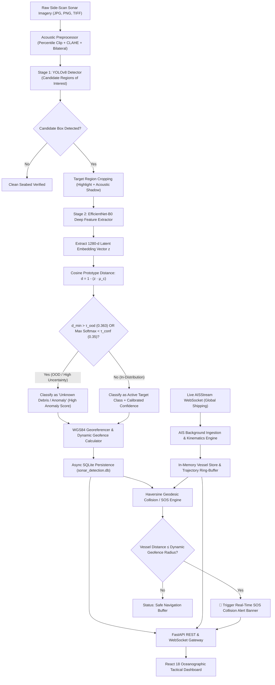

# 🌊 SamudraRakshak (SIH 26057): AI-Powered Automated Side-Scan Sonar Marine Debris Detection & Live AIS Maritime Tracking System

> **Ministry of Earth Sciences (MoES) — Smart India Hackathon**  
> **Official Comprehensive Project, Architecture, & Technical Evaluation Report**

---

## 1. Executive Summary

Underwater marine debris (such as sunken vessel wreckage, discarded ghost fishing nets, lost cargo containers, subsea pipelines, and unexploded naval ordnance) poses catastrophic threats to marine ecosystems, commercial navigation channels, and subsea infrastructure. While **Side-Scan Sonar (SSS)** is the global standard acoustic sensor for seabed mapping, traditional manual interpretation suffers from severe operational fatigue, high latency, and false positive vulnerability in turbid waters and acoustic reverberation bands.

**SamudraRakshak (SIH 26057)** is an advanced, production-grade maritime intelligence and subsea safety platform that unifies:
1. **Acoustic Preprocessing & Denoising**: Physics-aware contrast enhancement (CLAHE, percentile clipping, bilateral filtering) for high-turbidity acoustic backscatter.
2. **2-Stage Hybrid AI Detection**: YOLOv8 anchor-free region proposal combined with an EfficientNet-B0 latent feature embedding model and Out-of-Distribution (OOD) rejection to eradicate false alarms on natural seabed textures.
3. **WGS84 Georeferencing & Dynamic Geofences**: Automated projection of acoustic pixel centroids into metric across-track/along-track offsets and WGS84 GPS coordinates with risk-weighted safety exclusion buffers.
4. **Real-Time AIS Maritime Vessel Ingestion**: Live streaming of international and coastal shipping traffic via AISStream WebSocket clusters and ITU-R M.1371 kinematic parsing.
5. **Continuous Collision Proximity & SOS Alerting**: Real-time geodesic proximity computation between active surface vessels and subsea hazards, triggering automated tactical warnings and emergency SOS broadcasts.
6. **Multi-Source Maritime Incident Intelligence**: Ingestion from global feeds (NOAA, USCG, AIS feeds, maritime alerts) for unified situational awareness.

---

## 2. Complete Technology Stack

| Layer / Domain | Technology / Library | Architectural Function & Rationale |
| :--- | :--- | :--- |
| **Acoustic Preprocessing** | `OpenCV (cv2)`, `NumPy` | CLAHE ($8\times 8$ tile grid, clip limit 2.5), 1%–99% percentile clipping, bilateral edge-preserving filtering ($d=7, \sigma=50$). |
| **Stage 1: Region Proposal** | `Ultralytics YOLOv8n` | Ultra-fast ($< 40\text{ms}$) anchor-free object detector proposing acoustic regions of interest. |
| **Stage 2: Crop Classifier & OOD** | `PyTorch EfficientNet-B0` | 1280-dimensional latent embedding extraction with cosine prototype distance calculation for OOD anomaly rejection. |
| **Geospatial & Kinematics Engine** | `Haversine`, `PyProj`, `WGS84` | Geodesic distance calculation, slant-range sonar geometry projection, and collision trajectory calculation. |
| **Backend API & WebSockets** | `FastAPI`, `Uvicorn`, `WebSockets` | Asynchronous high-throughput ASGI web framework with OpenAPI/Swagger documentation. |
| **Database & Persistence** | `SQLite`, `Async SQLAlchemy`, `aiosqlite` | Zero-configuration asynchronous relational storage for sonar detections, bounding boxes, anomaly scores, and incident logs. |
| **Live AIS Ingestion** | `AISStream WebSocket`, `WebSockets` | Live real-time ITU-R M.1371 vessel telemetry ingestion with automated reconnect and fallback simulation. |
| **Frontend Tactical HUD** | `React 18`, `Vite`, `TailwindCSS` | High-performance interactive dashboard featuring 4-stage image comparison, synchronized hover tables, and Leaflet situational maps. |
| **Geospatial Mapping UI** | `Leaflet`, `React-Leaflet` | Multi-layer interactive oceanographic chart with debris markers, dynamic geofences, rotated vessel icons, and historical trajectories. |

---

## 3. End-to-End System Architecture



---

## 4. 2-Stage Machine Learning Pipeline & Out-of-Distribution (OOD) Rejection

### 4.1. The False Positive Bottleneck in Sonar AI
Conventional single-stage detectors force every candidate acoustic box into one of the trained classes, leading to severe false positives on sand ripples, acoustic reverberations, and natural geological formations.

### 4.2. Mathematical Formulation of the 2-Stage Architecture

1. **Stage 1 (Region Proposal)**:
   YOLOv8 proposes bounding box candidates $B_i = [x_1, y_1, x_2, y_2]$ with initial confidence scores.

2. **Stage 2 (Latent Feature Extraction)**:
   The crop containing both the specular highlight and acoustic shadow is passed through EfficientNet-B0 to extract an embedding vector $\mathbf{z} \in \mathbb{R}^{1280}$:
   $$\mathbf{z} = \frac{f_{\theta}(\text{crop})}{\|f_{\theta}(\text{crop})\|_2}$$

3. **Prototype Centroid Evaluation**:
   For each verified class $c \in \mathcal{C}$, the class prototype centroid $\boldsymbol{\mu}_c$ is pre-computed from the clean training set:
   $$\boldsymbol{\mu}_c = \frac{1}{N_c} \sum_{i=1}^{N_c} \mathbf{z}_i^{(c)}$$
   The minimum cosine distance to any known class is:
   $$d_{\min}(\mathbf{z}) = \min_{c \in \mathcal{C}} \left( 1 - \mathbf{z} \cdot \boldsymbol{\mu}_c \right)$$

4. **OOD Decision Rule**:
   $$\text{Decision}(\mathbf{z}) = \begin{cases} \text{Unknown Debris / Anomaly}, & \text{if } d_{\min}(\mathbf{z}) > \tau_{\text{ood}} \ (0.363) \lor \max P(y=c|\mathbf{z}) < \tau_{\text{conf}} \ (0.35) \\ \arg\max_{c} P(y=c|\mathbf{z}), & \text{otherwise} \end{cases}$$

---

## 5. Dataset Audit & Verified Taxonomy

| Class ID | Target Class | Verified Train Instances | Verified Val Instances | Independent Test Instances | Risk Category |
| :---: | :--- | :---: | :---: | :---: | :--- |
| **0** | `ghost_net` | 29 (18 imgs) | 9 (5 imgs) | 3 (2 imgs) | High (Entanglement) |
| **1** | `metal_drum` | 67 (39 imgs) | 14 (8 imgs) | 1 (1 img) | High (Chemical Hazard) |
| **2** | `plastic_debris` | 33 (29 imgs) | 8 (7 imgs) | 3 (2 imgs) | Medium (Ecological) |
| **3** | `sunken_wreckage` | 32 (32 imgs) | 13 (11 imgs) | 1 (1 img) | Extreme (Navigational) |
| **4** | `tire_wheel` | 21 (14 imgs) | 8 (5 imgs) | 2 (2 imgs) | Low/Medium |
| **—** | **Negative Background** | 40 images | 7 images | 3 images | Suppression Controls |
| **TOTAL** | | **182 boxes (152 imgs)** | **52 boxes (38 imgs)** | **10 boxes (11 imgs)** | **100% Verified, 0 Leakage** |

---

## 6. Real-Time AIS & Collision Proximity Engine

### 6.1. Geodesic Proximity Computation
The system continuously monitors vessel distances to detected seabed hazards using the great-circle Haversine distance formula:

$$a = \sin^2\left(\frac{\Delta \phi}{2}\right) + \cos(\phi_1)\cos(\phi_2)\sin^2\left(\frac{\Delta \lambda}{2}\right)$$
$$d = 2 R \cdot \arctan2\left(\sqrt{a}, \sqrt{1-a}\right)$$

Where $R = 6371\text{ km}$ (Earth mean radius), $\phi$ is latitude, and $\lambda$ is longitude in radians.

### 6.2. Dynamic Geofence Sizing
$$R_{\text{geofence}} = R_{\text{base}} + k_{\text{alt}} \cdot \text{Altitude} + k_{\text{risk}} \cdot \text{SeverityWeight}$$

* If $d \le R_{\text{geofence}}$, an immediate **SOS Hazard Collision Alert** is triggered across the unified tactical HUD.

---

## 7. REST & WebSocket API Reference

| Method | Endpoint | Description |
| :--- | :--- | :--- |
| `GET` | `/api/health` | System health check, model metadata, and backend version. |
| `POST` | `/api/detect` | Upload raw side-scan sonar image for 2-stage AI detection and georeferencing. |
| `GET` | `/api/history` | Retrieve paginated historical detection logs with bounding boxes and metadata. |
| `GET` | `/api/samples` | Fetch pre-loaded test sonar imagery samples. |
| `GET` | `/api/ais/vessels` | Retrieve live tracked AIS maritime vessels with coordinates, SOG, COG, and trails. |
| `GET` | `/api/ais/alerts` | Retrieve active collision warnings and proximity alerts between vessels and debris. |
| `GET` | `/api/incidents` | Multi-source maritime incident intelligence feed with severity filtering. |
| `WS` | `/api/ais/ws` | Live WebSocket stream for real-time vessel telemetry and instant SOS broadcasts. |

---

## 8. Quickstart & Deployment Guide

### Prerequisites
- Python 3.10+
- Node.js 18+ and npm

### 1-Command Full-Stack Launch
```bash
# From the project directory:
python run_app.py
```

### Manual Individual Startup
```bash
# Terminal 1: Backend Server
cd SIH_imageclassification-main
python -m uvicorn backend.main:app --host 127.0.0.1 --port 8000 --reload

# Terminal 2: Frontend Dashboard
cd SIH_imageclassification-main/frontend
npm run dev
```

### Access Points
- **Frontend Dashboard**: `http://localhost:5173/`
- **Backend API Base**: `http://127.0.0.1:8000`
- **Interactive Swagger Docs**: `http://127.0.0.1:8000/docs`

---

## 9. Conclusion & Impact

SamudraRakshak (SIH 26057) delivers a transformative, AI-driven leap in maritime autonomy and subsea ecological safety. By addressing the critical bottleneck of acoustic false alarms with a mathematically grounded 2-Stage OOD classifier and unifying subsea acoustic detections with live AIS surface vessel telemetry, the platform provides maritime authorities, naval forces, and environmental agencies with an unprecedented level of real-time oceanic situational awareness.
