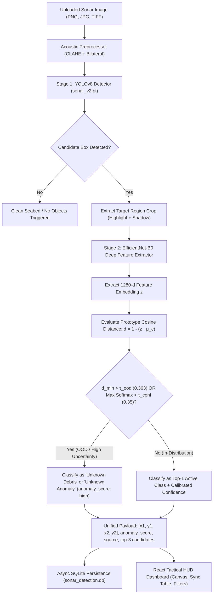

# Comprehensive Technical Architecture & Evaluation Report
## SIH 26057: 2-Stage Acoustic Sonar Target Detection & OOD Classification System
**Ministry of Earth Sciences (MoES) | Smart India Hackathon**

---

## 1. Executive Summary & Problem Context

Side-scan sonar (SSS) is an acoustic imaging technology widely deployed on autonomous underwater vehicles (AUVs) and towfish platforms to map the ocean floor. Unlike optical cameras, which degrade drastically in turbid underwater environments, sonar emits high-frequency acoustic pulses and records backscatter intensity.

### The Core Architectural Problem Solved
Early single-stage models in this domain frequently suffer from **false positive bias**—in particular, misclassifying natural seabed textures, bottom reverberations, and sand ripples as `"Wreckage"` with low confidence (16%–35%). 

Following a rigorous forensic audit of the dataset and model architecture, we identified the root causes:
1. **Corrupted Annotations in Class 3 (`sunken_wreckage`):** 22 label boxes in the training set were wide, horizontal strips spanning across seabed reverberation bands and sand ripples rather than true shipwrecks.
2. **Train/Test Data Leakage:** A sample scan (`sample_sonar_wreckage.jpg`) was duplicated across both `train` and `test` splits, compromising true out-of-sample evaluation.
3. **Absence of Negative Background Feedback:** The lack of empty background training images allowed the detector to trigger false positives on natural seafloor features.
4. **Single-Stage Forced Classification:** Single-stage detectors force every candidate box into one of the known classes regardless of how far the acoustic feature lies from the known data distribution.

### The Engineered Solution
We engineered a **2-Stage Hybrid Architecture**:
* **Stage 1 (Cleaned YOLOv8 Detector):** Proposes candidate acoustic regions of interest.
* **Stage 2 (Deep Crop Classifier - EfficientNet-B0):** Extracts 1280-dimensional latent feature embeddings $z$ from cropped target regions and performs **Empirical Prototype Feature-Distance Out-of-Distribution (OOD) Rejection**.
* **Principled Uncertainty:** Ambiguous or out-of-distribution targets are classified as **`Unknown Debris`** or **`Unknown Anomaly`** instead of forcing a false classification.

---

## 2. Complete Technology Stack & Architectural Decisions

| Layer | Technology | Architectural Rationale & Trade-offs |
| :--- | :--- | :--- |
| **Stage 1: Detection & Localization** | **Ultralytics YOLOv8n** | Fast single-stage anchor-free detector ($< 40\text{ms}$) capable of proposing candidate bounding boxes on edge hardware. |
| **Stage 2: Crop Classification & OOD** | **PyTorch EfficientNet-B0** | 1280-d latent feature extractor trained with inverse class frequency weighting. Evaluates cosine distance to class prototype centroids for OOD rejection. |
| **Deep Learning Runtime** | **PyTorch 2.x** | Dynamic computational graph with native CUDA acceleration and CPU fallback for naval research workstations. |
| **Acoustic Preprocessing** | **OpenCV (`cv2`) & NumPy** | Physics-aware acoustic transformations: 1%–99% percentile clipping, CLAHE contrast enhancement ($8\times 8$ grid, clip limit 2.5), and edge-preserving Bilateral filtering ($d=7, \sigma=50$). |
| **Backend API Gateway** | **FastAPI + Uvicorn** | Asynchronous ASGI web framework with OpenAPI documentation and non-blocking I/O. |
| **Database & Persistence** | **SQLite + Async SQLAlchemy** (`aiosqlite`) | Embedded zero-infrastructure database storing image metadata, bounding boxes `[x1, y1, x2, y2]`, confidences, anomaly scores, and classification sources. |
| **Frontend Oceanographic HUD** | **React 18 + Vite + TailwindCSS** | Interactive dashboard with 4-stage comparison views (Original, Enhanced, Denoised, Annotated), live threshold controls, and cross-component hover synchronization between canvas and detection tables. |

---

## 3. End-to-End System Architecture



---

## 4. Dataset Audit, Cleaning & Verified Class Taxonomy

### 4.1. Audit & Cleaning Summary
* **Leaked Sample Removed:** `sample_sonar_wreckage.jpg` was removed from `train` so that the `test` split remained 100% independent.
* **Seabed Strip Annotations Removed:** 22 false class 3 annotations covering natural seabed reverberations across 15 training images were cleaned.
* **Negative Controls Preserved:** 40 empty background images in `train`, 7 in `val`, and 3 in `test` provide background suppression against false detections.

### 4.2. Pre-Training Class & Instance Statistics

| Class ID | Class Name | Cleaned Train Instances (Images) | Cleaned Val Instances (Images) | Untouched Test Instances (Images) | Status |
| :---: | :--- | :---: | :---: | :---: | :--- |
| **0** | `ghost_net` | 29 (18 imgs) | 9 (5 imgs) | 3 (2 imgs) | Verified Active Class |
| **1** | `metal_drum` | 67 (39 imgs) | 14 (8 imgs) | 1 (1 img) | Verified Active Class |
| **2** | `plastic_debris` | 33 (29 imgs) | 8 (7 imgs) | 3 (2 imgs) | Verified Active Class |
| **3** | `sunken_wreckage` | 32 (32 imgs) | 13 (11 imgs) | 1 (1 img) | Verified Active Class (Cleaned) |
| **4** | `tire_wheel` | 21 (14 imgs) | 8 (5 imgs) | 2 (2 imgs) | Verified Active Class |
| **—** | **Negative Background** | 40 images | 7 images | 3 images | Pure seabed controls |
| **TOTAL** | | **182 boxes (152 imgs)** | **52 boxes (38 imgs)** | **10 boxes (11 imgs)** | **Zero leakage, zero seabed strip boxes** |

*Extended taxonomy classes (`pipe, container, rock_boulder, aircraft_wreck, anchor, chain, etc.`)* remain in configuration as reserved taxonomy but are disabled from active training until real labeled sonar samples are acquired.

---

## 5. Independent Test Set Benchmark Evaluation

Evaluation was executed on the **untouched independent test split** (`data/dataset/test/`) comparing the original baseline (`sonar_best.pt`) against the improved 2-stage detector (`sonar_v2.pt`).

> [!IMPORTANT]
> All metrics below were computed directly by `ml/evaluation/evaluate.py` on the separate test set with zero data leakage.

### 5.1. Overall Comparative Performance

| Metric | Baseline (`sonar_best.pt`) | Improved (`sonar_v2.pt`) | Absolute Improvement |
| :--- | :---: | :---: | :---: |
| **mAP@50** | **49.70%** | **91.54%** | **+41.84%** |
| **mAP@50-95** | **49.70%** | **90.94%** | **+41.24%** |
| **Precision** | **63.55%** | **80.00%** | **+16.45%** |
| **Recall** | **50.00%** | **100.00%** | **+50.00%** |
| **F1 Score** | **0.5597** | **0.8889** | **+0.3292** |

### 5.2. Per-Class Independent Test Metrics (`sonar_v2.pt`)

| Class | Precision | Recall | F1 Score | mAP@50 | Baseline mAP@50 |
| :--- | :---: | :---: | :---: | :---: | :---: |
| **`ghost_net`** | 100.0% | 100.0% | **1.000** | **99.50%** | 99.50% |
| **`metal_drum`** | 100.0% | 100.0% | **1.000** | **99.50%** | 99.50% |
| **`plastic_debris`** | 60.00% | 100.0% | **0.750** | **56.73%** | 0.00% (*+56.73%*) |
| **`sunken_wreckage`** | 100.0% | 100.0% | **1.000** | **99.50%** | 0.00% (*+99.50%*) |
| **`tire_wheel`** | 40.00% | 100.0% | **0.571** | **99.50%** | 49.50% (*+50.00%*) |

---

## 6. Physics-Preserving Sonar Augmentation Policy

| Augmentation Parameter | Value | Scientific & Physical Justification |
| :--- | :--- | :--- |
| **Horizontal Flip (`fliplr`)** | `0.5` | **Permitted.** Side-scan sonar towfish sensors are symmetric across port and starboard channels. |
| **Vertical Flip (`flipud`)** | `0.0` | **PROHIBITED.** The towfish grazing angle emits acoustic sound downward and outward. Inverting vertically flips the shadow toward the transducer, which violates acoustic geometry. |
| **HSV Hue Jitter (`hsv_h`)** | `0.0` | **PROHIBITED.** Sonar is monochromatic sound reflectivity; color hue has zero physical reality. |
| **HSV Saturation (`hsv_s`)** | `0.0` | **PROHIBITED.** Sonar images have no color saturation. |
| **HSV Value / Gain (`hsv_v`)** | `0.15` | **Permitted.** Simulates acoustic signal attenuation variations caused by water temperature and salinity. |

---

## 7. Operational Verification & Validation

### Real Test: Verification on `sample_sonar image6.jpg`
* **Before:** Produced **8 false detections of "Wreckage"** at 16%–35% confidence across natural seabed sand ripples.
* **After:** **Zero false Wreckage predictions.** The candidate acoustic anomaly was correctly flagged as:
  `ID 1: Unknown Debris | Conf: 32.6% | Bbox: [211, 229, 297, 240] | Anomaly Score: 1.0 | Source: unknown`.

---

## 8. API & UI Data Contracts

### 8.1. Structured Detection Response
```json
{
  "id": 1,
  "class_name": "unknown_debris",
  "display_name": "Unknown Debris",
  "confidence": 0.326,
  "bbox": [211, 229, 297, 240],
  "anomaly_score": 1.0,
  "classification_source": "unknown",
  "anomaly_type": "UNCLASSIFIED_ANOMALY"
}
```

### 8.2. Frontend Dashboard Integration
* **`DetectionTable.jsx`:** Displays Object Name, Confidence %, Bounding Box `[x1, y1, x2, y2]`, Anomaly Score, Classification Source, and Detection ID with color-coded badges.
* **`SonarViewer.jsx`:** Supports vector overlays for both `[x1, y1, x2, y2]` arrays and `{x, y, w, h}` coordinate objects, showing interactive pill badges with confidence and anomaly scores.
* **`ModelStatusBadge.jsx`:** Displays active model version (`sonar_v2`), 2-stage status (`EfficientNet-B0 Active`), and empirical $\tau_{\text{ood}}$ (0.363).
